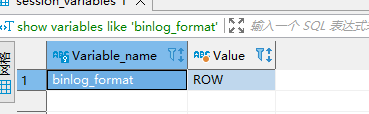

# Canal 简单使用

## Windows MySql8.0 配置

### 管理员命令

+ net stop mysql80
+ net start mysql80

### 查看 myslq 配置

需要打开 log_bin， 同时日志的记录格式为Row

1. show variables like 'log_bin';

2. show variables like 'binlog_format';

3. 创建canle的账户（使用root账户也是可以的）

~~~Sql
CREATE USER canal IDENTIFIED BY 'canal';
GRANT SELECT, REPLICATION SLAVE, REPLICATION CLIENT ON *.* TO 'canal'@'%';
GRANT ALL PRIVILEGES ON *.* TO 'canal'@'%' ;
FLUSH PRIVILEGES;
~~~

## 配置canal

### instance.properties

解压后进入conf\example文件，打开instance.properties配置文件：

启动

bin文件夹下启动start.bat

- ccanal.instance.filter.regex ： 要同步的表，多个表用逗号隔开

## 编写canal-client

接下来我们需要在项目中整合canal-client来同步canal-server中的数据，然后写入Redis

第一步：导入如下依赖，我这里使用了 `canal-spring-boot-starter` 来整合canal-client

## 注意事项

创建的数据库canal帐号没有起到作用，后来使用的root帐号